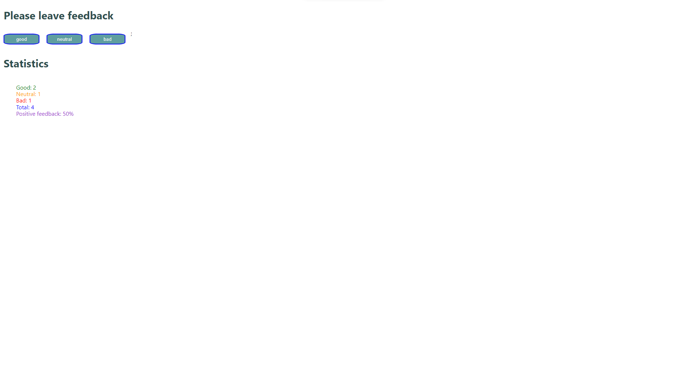

# Hello, I would like to introduce myself to you. My name is react project "Feedback"

This project was created to collect response statistics for Cafe Expresso from its customers.

The project took into account opinions: good, neutral and bad. Displaying the total number of collected responses from all categories and the percentage of positive responses has also been added.

The application allows you to quickly and easily add a company rating.

This application consolidates the material from the online course.
This project was created with
[Create React App] (https://github.com/facebook/create-react-app)

Hooks were used in the project.

## Technologies
- "JavaScript"
- "react": "^18.1.0",
- "node": "v18.16.1",
- "react-dom": "^18.1.0",
- "components": "^0.1.0",
- "eslint-config-react-app": "^7.0.1",
- "prop-types": "^15.8.1",

## Setup
- git clone - clone the remote repository to your computer locally;
- npm install - create dependencies;
- npm start - run the application, access to it will be at localhost:3000;